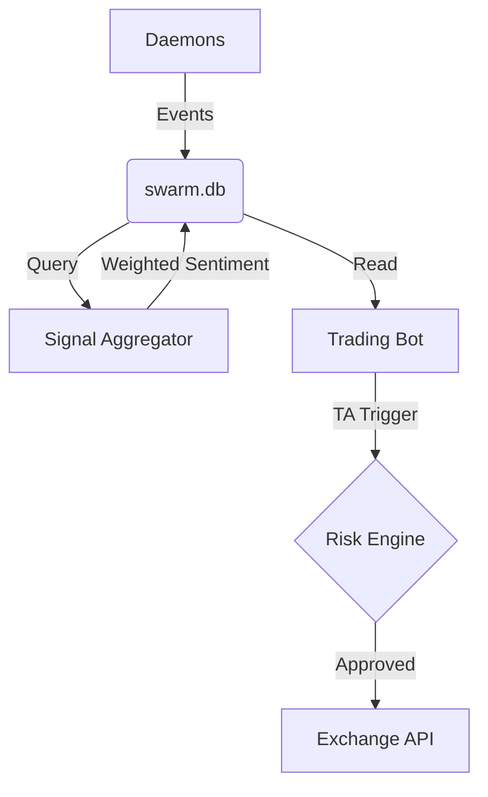

# SYGNIF Meta-Strategy Architecture

To trade profitably using the SYGNIF data, a bot must move beyond simple TA and into a **Hierarchical Signal Model**.

## 1. Data Layer (The Foundation)
- **Store**: All daemons write to `swarm.db` (SQLite).
- **Format**: Structured JSON in the `meta` column.
- **Topics**: `chain.*`, `evm.*`, `xchg.*`, `market.*`, `ecosystem.*`.

## 2. Signal Aggregator (The Brain)
Instead of the strategy making network calls, a dedicated **Signal Aggregator** daemon runs every 60s:
- **Normalization**: Maps diverse events to a shared score (-100 to +100).
- **Time-Decay**: Older signals lose weight. A $100M mint from 10 minutes ago is more relevant than one from 10 hours ago.
- **Cross-Corroboration**: If `market.premium` and `chain.whale` both signal bullishness, the combined weight is amplified (non-linear scaling).
- **Output**: Writes a single `weighted_sentiment` row to `swarm.db` for the trading bot to read.

## 3. Risk Engine (The Guard)
The Risk Engine gates the Execution layer based on global "Health" metrics:
- **Volatility Filter**: Blocks entries if `ATR_14` is too high relative to price.
- **Liquidity Check**: Ensures current depth in `swarm_entries` (e.g., Uniswap V3 volume) supports the trade size.
- **Downtime Protection**: Uses `utils/sygnif_health.py` to block trades if the data feed is stale.

## 4. Execution Layer (The Hand)
The actual trading bot (e.g., Freqtrade with `SygnifStrategy.py`):
- **Core TA**: Uses standard indicators (RSI, EMA) for precise entry/exit timing.
- **Sentiment Filter**: Only executes a TA signal if `weighted_sentiment` in `swarm.db` exceeds a threshold (e.g., > 60).
- **Dynamic Sizing**: Increases leverage/size when `weighted_sentiment` is near 100 (high-conviction setups).

